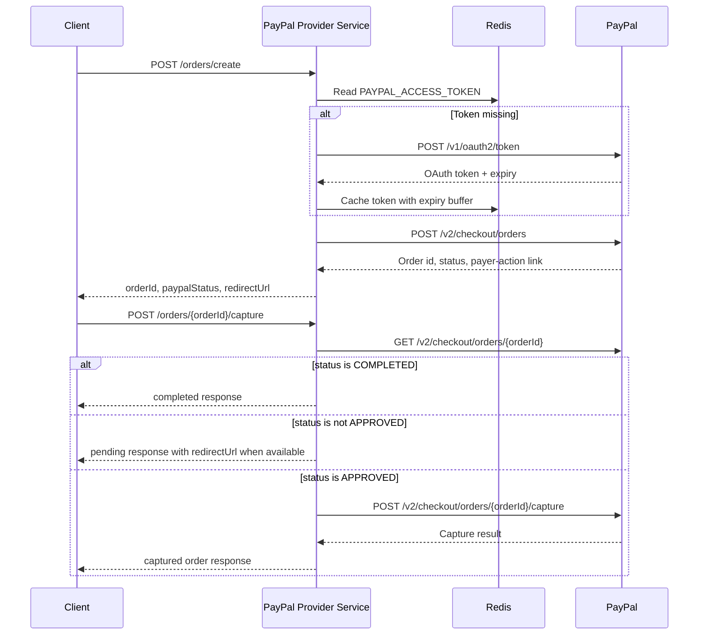

# PayPal Provider Service


A Spring Boot payment provider microservice that integrates with PayPal Checkout Orders. The service creates PayPal orders, returns payer approval links, validates capture requests, checks order status, captures approved payments, and caches PayPal OAuth access tokens in Redis to reduce authentication calls.

## Highlights

- Creates PayPal Checkout orders with `CAPTURE` intent.
- Returns PayPal payer-action redirect URLs for customer approval.
- Captures approved PayPal orders and gracefully handles already completed or pending payments.
- Caches OAuth access tokens in Redis with an expiry buffer.
- Uses Spring `RestClient` backed by Apache HttpClient connection pooling.
- Centralizes PayPal error mapping into consistent application error responses.
- Supports environment-specific Spring profiles for local, dev, and prod deployment.
- Includes actuator, structured logging, Micrometer tracing, Eureka client support, and AWS Secrets Manager configuration for deployed environments.

## Tech Stack

| Area | Technology |
| --- | --- |
| Runtime | Java 17 |
| Framework | Spring Boot 3.4.2 |
| Build | Maven Wrapper |
| HTTP client | Spring `RestClient` + Apache HttpClient 5 |
| Cache | Spring Data Redis |
| Config/secrets | Spring profiles, AWS Secrets Manager |
| Discovery/ops | Eureka Client, Spring Boot Actuator, Micrometer Tracing |
| Serialization | Gson, Jackson |
| Boilerplate reduction | Lombok |

## Service Flow



## API Reference

Base URL for local development:

```text
http://localhost:8080
```

### Create Order

```http
POST /orders/create
Content-Type: application/json
```

Request body:

```json
{
  "amount": 49.99,
  "currencyCode": "USD",
  "returnUrl": "https://example.com/payments/success",
  "cancelUrl": "https://example.com/payments/cancel"
}
```

Successful response:

```json
{
  "orderId": "PAYPAL_ORDER_ID",
  "paypalStatus": "PAYER_ACTION_REQUIRED",
  "redirectUrl": "https://www.sandbox.paypal.com/checkoutnow?token=PAYPAL_ORDER_ID"
}
```

Example:

```bash
curl -X POST http://localhost:8080/orders/create \
  -H "Content-Type: application/json" \
  -d '{
    "amount": 49.99,
    "currencyCode": "USD",
    "returnUrl": "https://example.com/payments/success",
    "cancelUrl": "https://example.com/payments/cancel"
  }'
```

### Capture Order

```http
POST /orders/{orderId}/capture
```

Successful response:

```json
{
  "orderId": "PAYPAL_ORDER_ID",
  "paypalStatus": "COMPLETED"
}
```

Example:

```bash
curl -X POST http://localhost:8080/orders/PAYPAL_ORDER_ID/capture
```

### Health Check

```http
GET /actuator/health
```

## Error Response

Errors are returned through the global exception handler in a consistent shape:

```json
{
  "errorCode": "30003",
  "errorMessage": "Amount must be a valid value greater than zero"
}
```

Common validation and provider errors include:

| Code | Meaning |
| --- | --- |
| `30001` | Invalid request |
| `30002` | Missing currency code |
| `30003` | Invalid amount |
| `30004` | Missing return URL |
| `30005` | Missing cancel URL |
| `30007` | PayPal service unavailable |
| `30008` | PayPal returned an error |
| `30011` | Missing order ID |
| `30012` | Resource not found |

## Local Setup

### Prerequisites

- JDK 17
- Redis running locally on port `6379`
- PayPal sandbox client ID and client secret

### Configure Environment Variables

The local profile reads PayPal credentials from environment variables:

```bash
export PAYPAL_CLIENT_ID="your-paypal-sandbox-client-id"
export PAYPAL_CLIENT_SECRET="your-paypal-sandbox-client-secret"
```

PowerShell:

```powershell
$env:PAYPAL_CLIENT_ID="your-paypal-sandbox-client-id"
$env:PAYPAL_CLIENT_SECRET="your-paypal-sandbox-client-secret"
```

### Start Redis

If Redis is available through Docker:

```bash
docker run --name paypal-provider-redis -p 6379:6379 -d redis:7-alpine
```

### Run the Service

Unix/macOS:

```bash
./mvnw spring-boot:run
```

Windows:

```powershell
.\mvnw.cmd spring-boot:run
```

The application starts on port `8080` by default.

## Build and Test

Run tests:

```bash
./mvnw test
```

Build the executable jar:

```bash
./mvnw clean package
```

Run the packaged application:

```bash
java -jar target/paypal-provider-service.jar
```

## Configuration

Core configuration lives in `src/main/resources`.

| File | Purpose |
| --- | --- |
| `application.properties` | Shared application name, port, and active profile placeholder |
| `application-local.properties` | Local PayPal sandbox URLs, Redis localhost config, env-based credentials |
| `application-dev.properties` | Dev profile config with AWS Secrets Manager import |
| `application-prod.properties` | Production profile placeholder |
| `application-qa.properties` | QA profile placeholder |
| `application-uat.properties` | UAT profile placeholder |
| `logback-spring.xml` | Console and rolling file logging with trace/span IDs |

Important properties:

```properties
paypal.client.id=${PAYPAL_CLIENT_ID}
paypal.client.secret=${PAYPAL_CLIENT_SECRET}
paypal.outh.url=https://api-m.sandbox.paypal.com/v1/oauth2/token
paypal.create.order.url=https://api-m.sandbox.paypal.com/v2/checkout/orders
paypal.show.order.url=https://api-m.sandbox.paypal.com/v2/checkout/orders/{orderId}
paypal.capture.order.url=https://api-m.sandbox.paypal.com/v2/checkout/orders/{orderId}/capture
spring.redis.host=localhost
spring.redis.port=6379
```

> Note: The current code uses the property key `paypal.outh.url`. Keep that exact key unless the code is updated as well.

## Project Structure

```text
src/main/java/com/hulkhiretech/payments
|-- config/             # RestClient, HTTP connection pool, timeout configuration
|-- constant/           # Shared constants and application error codes
|-- controller/         # REST endpoints for create and capture order flows
|-- exception/          # Custom provider exception and global error handler
|-- http/               # Generic HTTP request model and RestClient execution engine
|-- paypal/             # PayPal request/response DTOs
|-- pojo/               # Public request/response models
|-- service/            # Token, Redis, validation, create, and capture services
|-- util/               # JSON and PayPal error helpers
`-- PaypalProviderServiceApplication.java
```

## Implementation Notes

- PayPal OAuth tokens are cached under `PAYPAL_ACCESS_TOKEN`.
- Token expiry is reduced by a 300-second buffer before writing to Redis.
- Create and capture calls send `PayPal-Request-Id` for request idempotency.
- Capture checks the PayPal order first:
  - `COMPLETED` returns a completed response without another capture call.
  - non-`APPROVED` returns the current status and payer-action redirect URL when available.
  - `APPROVED` proceeds to the PayPal capture endpoint.
- HTTP timeouts are configured as 10 seconds for connection acquisition, 10 seconds for connect, and 15 seconds for read.

## Roadmap Ideas

- Add controller/service unit tests for validation, mapping, token caching, and PayPal error branches.
- Introduce resilience patterns for PayPal timeouts, retries, and circuit breaking.
- Add OpenAPI/Swagger documentation for the REST contract.
- Externalize Redis and logging paths fully for containerized environments.
- Mask sensitive tokens in logs before production use.
